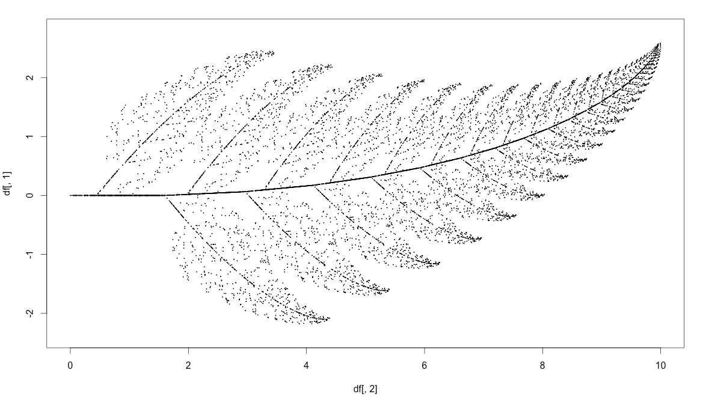

## The Reasons

<font size = '6'>
**1. It is cool to code something like this:**
</font>


---

## The Reasons

<font size = "6">
Coding in R looks like this:
</font>


---

## The Reasons

<font size = "6">
`By a simple logic, R is cool.`
</font>


---

## The Reasons

<font size = "6">
**2. Everyone wants to be cool.**
</font>


<br>
[圖片來源](http://www.teachprivacy.com/category/phishing/)

---

## The Reasons

<font size = "6">
`Again, by a simple logic, everyone should learn R!`
</font>


--- .segue bg:navy

## Our Gaol Today: Become a Cool Guy!


---

## Mini Project: Barnsley Fern Fractal

<font size = '6'>
Work this cool picture out.
<br>
<br>
</font>


---

## Mini Project: Barnsley Fern Fractal

<font size = '6'>
Work this cool picture out. <br>
And you can claim that you can do sketch by a computer!
</font>


--- .segue bg:navy

## Table of Content


--- &twocol

## Topics We Will Cover Today

*** =left
- DATA: 一切的起源
  - 資料屬性
  - 資料形態
- Loop
  - if/else if/else
  - for
  - while

*** =right
- 基礎運算
  - 邏輯運算
  - 數值運算
  
- Mini Project: 
  - Barnsley Fern Fractal (We will go for this today)
  - Battleship (Coming soon in DSC)


--- .segue bg:navy

## Data: Where the Story Begins

--- &twocol

## DATA: 一切的起源
*** =left
以資料屬性來分：
- Character (字串)
- Integer (整數)
- Numeric (雙浮點數 / 實數)
- Logical (邏輯值)
- Complex (複數)

*** =right
以資料形態來分：
- 一般變數
- Vector
- Matrix (Array)
- Factor and Data Frame

---

## 基本賦值語法


```r
(x <- 'R is easy to learn!') # 這是字串
(y <- 3) # 這是整數
(z <- pi) # 圓周率
(k <- 1 + 2i) # 複數
```

```
## [1] "R is easy to learn!"
```

```
## [1] 3
```

```
## [1] 3.142
```

```
## [1] 1+2i
```


--- .segue bg:green

## Logical


---

## Logical


```r
bol1 <- T
bol2 <- TRUE
bol3 <- F
bol1 == bol2
```

[1] TRUE

```r
bol1 & bol2
```

[1] TRUE

```r
bol3 | 4 > 5 
```

[1] FALSE

---

## Logical (續)


```r
4 > 2
```

[1] TRUE

```r
1 >= 2
```

[1] FALSE

```r
'Dboy' == 'Dboy'
```

[1] TRUE

```r
a <- NA
a == NA     # 要用 is.na(a) 才會回傳 TRUE。(另外還有 is.nan)
```

[1] NA


---

## Fun Time

### 於 Console 中依續執行下列程式碼。

1. my_vec <- c(1, 2, 5, 90, 37)
2. ind <- my_vec >= 5
3. sum(ind)


---

## Fun Time

### 於 Console 中依續執行下列程式碼。

1. my_vec <- c(1, 2, 5, 90, 37)
2. ind <- my_vec >= 5
3. sum(ind) 

`猜猜看答案會是多少? (sum 是 R 中的內建函式，用以求和。)`

--- .segue bg:navy

## Loops

--- .segue bg:green

## If Loop

---

## If Loop

### if / else
Syntex:

    if (condition_1){
        #Do something here....
    } else if (conditon_2){
        #Do something here
    } else {
        #Do something here
    }


Note: **else if** and **else** are optional.

---

## Exercise: SVM Classifier

<font size='5'>
`Magic Vector: c(-0.04625854, 0.5211828, -1.003045, -0.4641298)`
</font>


---

## Exercise: SVM Classifier

<font size='5'>
`Magic Vector: c(-0.04625854, 0.5211828, -1.003045, -0.4641298)`<br>
</font>

(暫時)不要問我怎麼把這個向量生出來的。(汗)


---

## Exercise: SVM Classifier

<font size='5'>
`Magic Vector: c(-0.04625854, 0.5211828, -1.003045, -0.4641298)`<br>
</font>

或許你可以問助教，助教都比我厲害。


---

## Exercise: SVM Classifier

<br>

<font size = 6''>
[Data](https://dl.dropboxusercontent.com/u/5487490/MLDM%20Monday/RBasic/MLDM_RBasic_ForLoop_Ex.RData)
</font>

---

## Exercise: SVM Classifier

> 1. 寫個 if 迴圈計算 X1 中某一筆資料與 magic vector 內積的結果。<br> (sum(X1[i, ] * magic_vec))
> 2. 如果內積值大於或等於 -1，print('setosa');反之，print('versicolor')
> 3. 跟 y1 比對一下，有何發現？


--- .segue bg:green

## For Loop

---

## For Loop

### Syntex:

    for (iterator){
        #Do something here....
    } 

### Example: 土炮 sum()


```r
# 從 1 加到 10
final_result <- 0
for (i in 1:10){
        final_result <- final_result + i
}
(final_result)
```

```
## [1] 55
```


--- .segue bg:navy

## Vector, List, Factor, Data Frame and Matrix


--- .segue bg:green

## Vector

---

## Vector

- c(): concatenation function

- 範例：


```r
vec1 <- c(1, 2, 3)
vec2 <- c('a', 'b', 'c')
```

- vector 中所有元素都必須是同一種資料屬性。

- Named Vector:


```r
Bob <- c(age = 27, height = 187, weight = 80)
Bob
```

```
##    age height weight 
##     27    187     80
```

---

## **Funtime**

```r
mix_vec1 <- c('a', 2)
mix_vec2 <- c(2, T)
```
猜看看結果會如何?

> 1. [1] "a" "2"
> 2. [1] 2 1
> 3. Why??


---

## Useful Methods (Vector)
- length(): 
  - 語法: **length(my_vec)**
  - 傳回 my_vect 的長度
- +, -, *, /:
  - 語法: **my_vec + other_vec**
  - 注意: R 中所有運算皆向量化。(element by element operation)
- names():
 - 語法: **names(my_vec)**
 - 傳回 my_vec 各維度的名字。
- []:
 - 語法: **my_vec[index]**
 - 傳回 my_vec 的第 index 個元素。


---

## Examples


```r
vec1 <- c(1, 2, 3)
vec2 <- c(4, 5, 6)
vec1 + vec2
vec1 - vec2
vec1 * vec2
vec1[1] + vec2[3]
```

```
## [1] 5 7 9
```

```
## [1] -3 -3 -3
```

```
## [1]  4 10 18
```

```
## [1] 7
```

---

## Examples (Cont.)


```r
names(Bob)
Bob['age']   # reference by name.
```

```
## [1] "age"    "height" "weight"
```

```
## age 
##  27
```

---

## Exercise

定義一個向量 me 記錄自己的身高(公分)、體重(公斤)與年齡。

---

## Exercise

定義一個向量 me 記錄自己的身高(公分)、體重(公斤)與年齡。

`如果我還想記錄頭髮的顏色跟電話號碼呢?`

> 1. 把 hair_color='Black' 存進去?
> 2. 如果電話是 +886 911333966 呢?


--- .segue bg:green

## List

---

## List

- list 是非常方便好用的資料形態。尤其是需儲存不同類型資料的時候，特別好用。

- Vector, Matrix, Data Frame and List.

- 還記得剛剛提過的優先順序嗎？
 - c(1, '2')
 - c(1, T)

- 比較：
 - list(1, '2')
 - list(1, T)

---

## List: Examples


```r
Bob <- list(age=27, weight = 80,
            favorite_data_name = 'iris', favorite_data = iris)
(age1 <- Bob[1])
class(age1)
(age2 <- Bob[[1]])
class(age2)
```

```
## $age
## [1] 27
```

```
## [1] "list"
```

```
## [1] 27
```

```
## [1] "numeric"
```

---

## List: Examples (Cont.)


```r
(Age_and_DataName <- Bob[c(1, 3)])
head(Bob[['favorite_data']])
```

```
## $age
## [1] 27
## 
## $favorite_data_name
## [1] "iris"
```

```
##   Sepal.Length Sepal.Width Petal.Length Petal.Width Species
## 1          5.1         3.5          1.4         0.2  setosa
## 2          4.9         3.0          1.4         0.2  setosa
## 3          4.7         3.2          1.3         0.2  setosa
## 4          4.6         3.1          1.5         0.2  setosa
## 5          5.0         3.6          1.4         0.2  setosa
## 6          5.4         3.9          1.7         0.4  setosa
```


---

## Play With List

### `Warmup for Battleship Mini Project: Drawing the Map`


```r
map =list(c('O', 'O', 'O', 'O', 'O'),
          c('O', 'O', 'O', 'O', 'O'),
          c('O', 'O', 'O', 'O', 'O'),
          c('O', 'O', 'O', 'O', 'O'),
          c('O', 'O', 'O', 'O', 'O'))
for (i in 1:length(map)){
        print(map[[i]])
}
```

```
## [1] "O" "O" "O" "O" "O"
## [1] "O" "O" "O" "O" "O"
## [1] "O" "O" "O" "O" "O"
## [1] "O" "O" "O" "O" "O"
## [1] "O" "O" "O" "O" "O"
```

--- .segue bg:green

## Factor and Data Frame


---

## Factor and Data Frame

- R 中有很多內建資料庫，其中包括你不可以不知道的 iris 資料庫。

- 用法也很簡單，只要輸入以下指令：


```r
data(iris)
head(iris)
```

```
##   Sepal.Length Sepal.Width Petal.Length Petal.Width Species
## 1          5.1         3.5          1.4         0.2  setosa
## 2          4.9         3.0          1.4         0.2  setosa
## 3          4.7         3.2          1.3         0.2  setosa
## 4          4.6         3.1          1.5         0.2  setosa
## 5          5.0         3.6          1.4         0.2  setosa
## 6          5.4         3.9          1.7         0.4  setosa
```

---

## Factor and Data Frame (Cont.)

1. names(iris) 將可以看到 iris 所有欄位的名字。

2. 關於 factor ，我們來看看下面這個例子。


```r
Species <- iris[, 'Species']
class(Species)                  # R 會告訴你他是個 factor。
Species2 <- as.numeric(Species) # 直接把 factor 轉成 numeric 向量。
Species2
# 你覺得上面這行 code 會跑出什麼呢? 試試看吧!
```

---

## Useful Functions for Data Frame

給定一個名叫 data 的 data frame

- names(data): 傳回 data 的所有欄位名稱。

- nrow(data)/ncol(data): 傳回 data 的列 / 行數目。

- head(data, n)/tail(data, n)/View(data)

- which(exp)

- sort/order

- max/min

- rbind/cbind: merge different data frames

---

## Examples: iris


```r
nrow(iris)    # 顯示 iris 的列數
ncol(iris)    # 顯示 iris 的行數
dim(iris)     # 顯示 iris 的行、列數
names(iris)   # 顯示 iris 的欄位名稱
```

```
## [1] 150
```

```
## [1] 5
```

```
## [1] 150   5
```

```
## [1] "Sepal.Length" "Sepal.Width"  "Petal.Length" "Petal.Width" 
## [5] "Species"
```

---

## Examples: iris (Cont.)


```r
head(iris, n = 10)    # 顯示 iris 前 10 筆資料 (預設為 6 筆)
```

```
##    Sepal.Length Sepal.Width Petal.Length Petal.Width Species
## 1           5.1         3.5          1.4         0.2  setosa
## 2           4.9         3.0          1.4         0.2  setosa
## 3           4.7         3.2          1.3         0.2  setosa
## 4           4.6         3.1          1.5         0.2  setosa
## 5           5.0         3.6          1.4         0.2  setosa
## 6           5.4         3.9          1.7         0.4  setosa
## 7           4.6         3.4          1.4         0.3  setosa
## 8           5.0         3.4          1.5         0.2  setosa
## 9           4.4         2.9          1.4         0.2  setosa
## 10          4.9         3.1          1.5         0.1  setosa
```

---

## Examples: iris (Cont.)


```r
tail(iris, n = 10)    # 顯示 iris 後 10 筆資料 (預設為 6 筆)
```

```
##     Sepal.Length Sepal.Width Petal.Length Petal.Width   Species
## 141          6.7         3.1          5.6         2.4 virginica
## 142          6.9         3.1          5.1         2.3 virginica
## 143          5.8         2.7          5.1         1.9 virginica
## 144          6.8         3.2          5.9         2.3 virginica
## 145          6.7         3.3          5.7         2.5 virginica
## 146          6.7         3.0          5.2         2.3 virginica
## 147          6.3         2.5          5.0         1.9 virginica
## 148          6.5         3.0          5.2         2.0 virginica
## 149          6.2         3.4          5.4         2.3 virginica
## 150          5.9         3.0          5.1         1.8 virginica
```

---

## Examples: iris (Cont.)


```r
ind1 <- which(iris[, 'Sepal.Length'] >= 6.5 & iris[, 'Species'] == 'virginica')
class(ind1)
iris1 <- iris[ind1, ]
head(iris1)
```

```
## [1] "integer"
```

```
##     Sepal.Length Sepal.Width Petal.Length Petal.Width   Species
## 103          7.1         3.0          5.9         2.1 virginica
## 105          6.5         3.0          5.8         2.2 virginica
## 106          7.6         3.0          6.6         2.1 virginica
## 108          7.3         2.9          6.3         1.8 virginica
## 109          6.7         2.5          5.8         1.8 virginica
## 110          7.2         3.6          6.1         2.5 virginica
```

---

## Examples: iris (Cont.)


```r
ind2 <- which(iris[, 'Sepal.Length'] < 5.8 & iris[, 'Species'] == 'setosa')
iris2 <- iris[ind2, ]
head(iris2)
```

```
##   Sepal.Length Sepal.Width Petal.Length Petal.Width Species
## 1          5.1         3.5          1.4         0.2  setosa
## 2          4.9         3.0          1.4         0.2  setosa
## 3          4.7         3.2          1.3         0.2  setosa
## 4          4.6         3.1          1.5         0.2  setosa
## 5          5.0         3.6          1.4         0.2  setosa
## 6          5.4         3.9          1.7         0.4  setosa
```

---

## Examples: iris (Cont.)


```r
iris3 <- rbind(iris1, iris2)
head(iris3)
```

```
##     Sepal.Length Sepal.Width Petal.Length Petal.Width   Species
## 103          7.1         3.0          5.9         2.1 virginica
## 105          6.5         3.0          5.8         2.2 virginica
## 106          7.6         3.0          6.6         2.1 virginica
## 108          7.3         2.9          6.3         1.8 virginica
## 109          6.7         2.5          5.8         1.8 virginica
## 110          7.2         3.6          6.1         2.5 virginica
```

---

## Examples: iris (Cont.)


```r
iris4 <- cbind(iris1[1:10, ], iris2[1:10, ])
head(iris4)   # View(iris4)
```

```
##     Sepal.Length Sepal.Width Petal.Length Petal.Width   Species
## 103          7.1         3.0          5.9         2.1 virginica
## 105          6.5         3.0          5.8         2.2 virginica
## 106          7.6         3.0          6.6         2.1 virginica
## 108          7.3         2.9          6.3         1.8 virginica
## 109          6.7         2.5          5.8         1.8 virginica
## 110          7.2         3.6          6.1         2.5 virginica
##     Sepal.Length Sepal.Width Petal.Length Petal.Width Species
## 103          5.1         3.5          1.4         0.2  setosa
## 105          4.9         3.0          1.4         0.2  setosa
## 106          4.7         3.2          1.3         0.2  setosa
## 108          4.6         3.1          1.5         0.2  setosa
## 109          5.0         3.6          1.4         0.2  setosa
## 110          5.4         3.9          1.7         0.4  setosa
```

---

## Examples: iris (Cont.)


```r
sort(iris[1:30, 2])
ind5 <- order(iris[, 'Sepal.Length'], iris[, 'Petal.Length'])
ind5[1:20]
class(ind5)
iris5 <- iris[ind5, ]
```

```
##  [1] 2.9 3.0 3.0 3.0 3.0 3.1 3.1 3.2 3.2 3.3 3.4 3.4 3.4 3.4 3.4 3.4 3.4
## [18] 3.5 3.5 3.5 3.6 3.6 3.7 3.7 3.8 3.8 3.9 3.9 4.0 4.4
```

```
##  [1] 14 39 43  9 42 23  7 48  4  3 30 13 46 12 31 25  2 38 10 35
```

```
## [1] "integer"
```

---

## Examples: iris (Cont.)


```r
head(iris5)
```

```
##    Sepal.Length Sepal.Width Petal.Length Petal.Width Species
## 14          4.3         3.0          1.1         0.1  setosa
## 39          4.4         3.0          1.3         0.2  setosa
## 43          4.4         3.2          1.3         0.2  setosa
## 9           4.4         2.9          1.4         0.2  setosa
## 42          4.5         2.3          1.3         0.3  setosa
## 23          4.6         3.6          1.0         0.2  setosa
```

---

## Examples: iris (Cont.)

我們也可以改變欄位的名字。


```r
iris6 <- iris
colnames(iris6) <- c('SLength', 'SWidth', 'PLength', 'PWidth', 'Sp')
# 也可以用 names(iris6) <- c('SLength', 'SWidth', 'PLength', 'PWidth', 'Sp')
head(iris6)
```

```
##   SLength SWidth PLength PWidth     Sp
## 1     5.1    3.5     1.4    0.2 setosa
## 2     4.9    3.0     1.4    0.2 setosa
## 3     4.7    3.2     1.3    0.2 setosa
## 4     4.6    3.1     1.5    0.2 setosa
## 5     5.0    3.6     1.4    0.2 setosa
## 6     5.4    3.9     1.7    0.4 setosa
```


---

## Play With It And You Will Master It!

我們用房貸餘額資料來練習!

`之後會在 ETL 課程再度碰到它，也會學到進階的資料處理技巧。`


---

## Play With It And You Will Master It!

我們用房貸餘額資料來練習!

`之後會在 ETL 課程再度碰到它，也會學到進階的資料處理技巧。`

到[這裡](https://raw.githubusercontent.com/ntuaha/TWFS/master/db/cl_info_other.csv)下載檔案。(cl_info_other.csv)


---

## Play With It And You Will Master It!


```r
# read.table 小技巧。
tmp <- read.table('cl_info_other.csv', sep = ',',
                 stringsAsFactors = F, header = T, nrows = 1000)
colClasses <- sapply(tmp, class)
DF <- read.table('cl_info_other.csv', sep = ',',
                 header = T, colClasses = colClasses)
```


---

## Play With It And You Will Master It!


```r
# read.table 小技巧。
tmp <- read.table('cl_info_other.csv', sep = ',',
                 stringsAsFactors = F, header = T, nrows = 1000)
colClasses <- sapply(tmp, class)
DF <- read.table('cl_info_other.csv', sep = ',',
                 header = T, colClasses = colClasses)
```


---

## Play With It And You Will Master It!

`Exercises`:

1. 顯示 DF 前 20 筆資料與所有欄位的名稱。
3. 將 mortgage_cnt < 2053 的資料另外儲存成 banks_below。
4. 將 mortgage_cnt >= 22538 的資料另外儲存成 banks_above。
5. 將 banks_below 與 banks_above 合併。
6. 將 DF 先依 mortgage_cnt 再依 mortgage_bal 排序。(Hint: order)

--- .segue bg:green

## Matrix

---

## Matrix

- 語法: **matrix(elements, norw, ncol, byrow = F)**
- 例子: 

```r
My_matrix1 <- matrix(1:6, 2, 3)
My_matrix2 <- matrix(1:6, 2, 3, byrow = T)
My_matrix1
My_matrix2
```

```
##      [,1] [,2] [,3]
## [1,]    1    3    5
## [2,]    2    4    6
```

```
##      [,1] [,2] [,3]
## [1,]    1    2    3
## [2,]    4    5    6
```

---

## Basic Operations on Matrix

- **+, -, *, /**
- 例子:

```r
My_matrix1 + My_matrix2
My_matrix1 * My_matrix2
```

```
##      [,1] [,2] [,3]
## [1,]    2    5    8
## [2,]    6    9   12
```

```
##      [,1] [,2] [,3]
## [1,]    1    6   15
## [2,]    8   20   36
```

---

## Basic Operation on Matrix (Cont.)

- **%*%**: Matrix Mulplication
- **t()**: Transpose
- 例子:

```r
vec <- c(1:3)
(t(vec))
```

```
##      [,1] [,2] [,3]
## [1,]    1    2    3
```

---

## Basic Operation on Matrix (Cont.)

- **%*%**: Matrix Mulplication
- **t()**: Transpose
- 例子:


```r
my_vec <- matrix(1:3, ncol = 1) 
My_matrix1 %*% my_vec
```

```
##      [,1]
## [1,]   22
## [2,]   28
```

```r
My_matrix1 %*% t(my_vec)
```

```
## Error: 非調和引數
```


---

## Basic Operation on Matrix (Cont.)

- **my_matrix[row_index, col_index]**
- 例子:

```r
My_matrix1[1, c(1, 3)]
```

```
## [1] 1 5
```

```r
My_matrix2[, c(2, 3)]
```

```
##      [,1] [,2]
## [1,]    2    3
## [2,]    5    6
```

---

## Basic Operation on Matrix (Cont.)

- **dim()**: Dimension
- 例子:

```r
dim(My_matrix1)
```

```
## [1] 2 3
```

> 1. 記得常常確認矩陣的維度。

> 2. 尤其是在做複雜的模型時，維度是個非常好的指標。

> 3. It's time for mini project!


--- .segue bg:navy

## Mini Project 1: Barnsley Fern Fractal

---

## Mini Project 1: Barnsley Fern Fractal

- 起始點:


- With 5% probability:


- With 81% probability:


- With 7% probability:


- With 7% probability:


---

## Barnsley Fern Fractal

- 依此規則迭代出 10000 點，再把這些點畫成圖。

- 只要用我們有學過的 **for**/**if** 迴圈和矩陣運算就可以做到這件事。

- 你應該會看到:



---

## Barnsley Fern Fractal: Tips

- 可以把迭代出來的點用一個 data.frame 存起來。(例如說存成 coor )

- 最後用 plot(x = coor[, 2], y = coor[, 1], plt = c(0, 10, -5, 5), cex = 0.1, asp = 1) 把它畫出來。

- 這些參數不懂沒關係，它們的唯一功能就只是讓圖變漂亮而已。(很多我也是 Google 來的XD)

---

## Barnsley Fern Fractal: Tips

- 可以把迭代出來的點用一個 data.frame 存起來。(例如說存成 coor )

- 最後用 plot(x = coor[, 2], y = coor[, 1], plt = c(0, 10, -5, 5), cex = 0.1, asp = 1) 把它畫出來。

- 這些參數不懂沒關係，它們的唯一功能就只是讓圖變漂亮而已。(很多我也是 Google 來的XD)

- [Template](https://dl.dropboxusercontent.com/u/5487490/RBasic/Barnsley_Fern_template.R)


---

## Barnsley Fern Fractal: Tips

- 可以把迭代出來的點用一個 data.frame 存起來。(例如說存成 coor )

- 最後用 plot(x = coor[, 2], y = coor[, 1], plt = c(0, 10, -5, 5), cex = 0.1, asp = 1) 把它畫出來。

- 這些參數不懂沒關係，它們的唯一功能就只是讓圖變漂亮而已。(很多我也是 Google 來的XD)

- [Template](https://dl.dropboxusercontent.com/u/5487490/RBasic/Barnsley_Fern_template.R)

- `敬請期待 Data Visualization 教學課程。`


--- .segue bg:orange

## Thanks for Your Attention!


