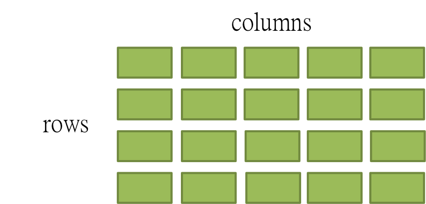
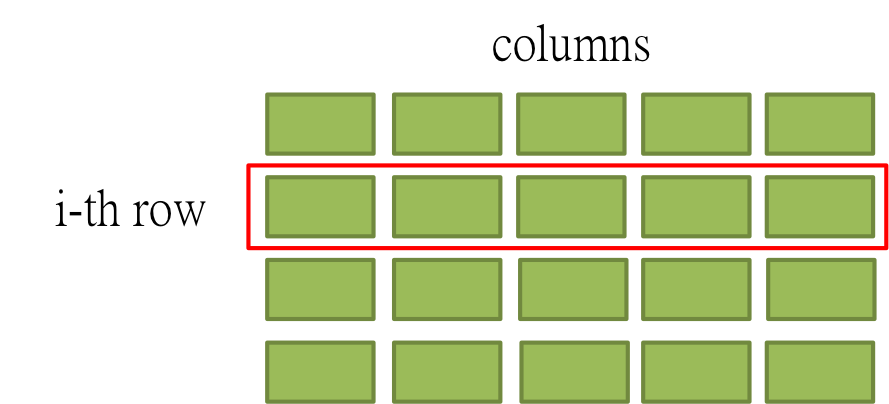
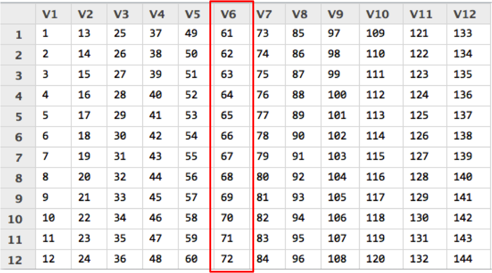
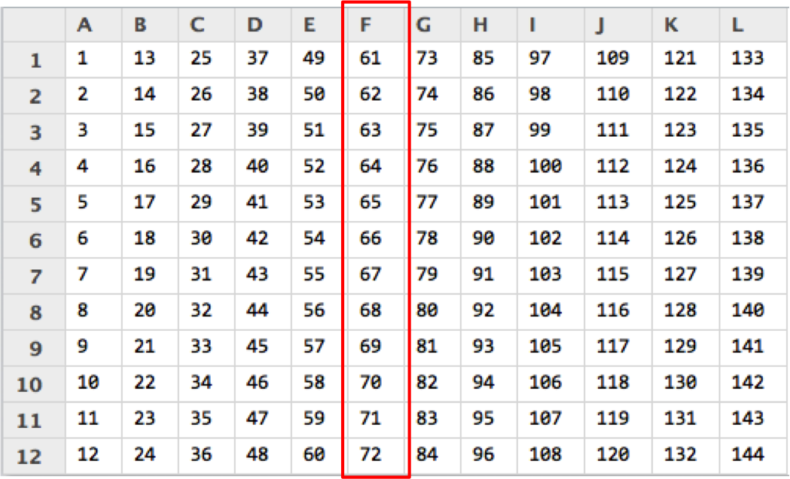
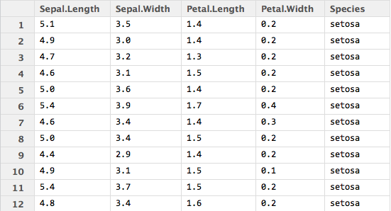
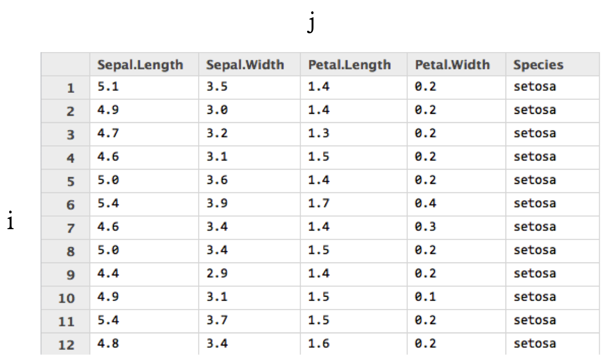
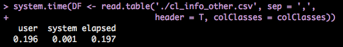
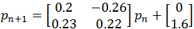

## Mini Project: Barnsley Fern Fractal

<font size = '6'>
Work this cool picture out.
<br>
<br>
</font>


---

## Mini Project: Barnsley Fern Fractal

<font size = '6'>
Work this cool picture out. <br>
And you can claim that you can do sketch by a computer!
</font>


---

## 最後讓我們打個廣告XDD

接下來的系列課程:

- ETL
- Data Analysis
- Data Visulization


---

## 最後讓我們打個廣告XDD

接下來的系列課程:

- <font size='6'> ETL </font>
- Data Analysis
- Data Visulization


---

## 最後讓我們打個廣告XDD

接下來的系列課程:

- ETL
- <font size='6'> Data Analysis </font>
- Data Visulization


---

## 最後讓我們打個廣告XDD

接下來的系列課程:

- ETL
- Data Analysis
- <font size='6'> Data Visulization </font>


---

## 最後讓我們打個廣告XDD

接下來的系列課程:

- ETL
- Data Analysis
- Data Visulization

<br>
<font size='6'>
`在今天的課程裡也會讓大家體驗一下每個課程的主題是什麼。`
</font>


--- .segue bg:navy

## Syllabus


--- &twocol

## Syllabus

*** =left
- **DATA: Where the Story Begins**
  - 資料屬性
  - 資料形態
- **Subsetting - Phase I**
  - Vector v.s List
  - Matrix Subsetting
  - Data Frame Subsetting
- **Subsetting - Phase II**
  - Matrix Subsetting (Cont.)
  - Data Frame Subsetting (Cont.)
- **Merging**
  - cbind v.s rbind

*** =right
- **Basic Operation**
  - Logical Operations
  - Arithmetic Operations
- **Loop**
  - if/else if/else
  - for
  - while
- **Mini Project**
  - Barnsley Fern Fractal
  - Battleship


--- .segue bg:navy

## Data: Where the Story Begins

--- &twocol

## DATA
*** =left
以資料屬性來分：
- Character (字串)
- Integer (整數)
- Numeric (雙浮點數 / 實數)
- Logical (邏輯值)
- Complex (複數)

*** =right
以資料形態來分：
- 一般變數
- Vector
- Matrix
- Factor and Data Frame

---

## Examples


```r
(x <- 'R is easy to learn!') # 這是字串
(y <- 3) # 這是整數
(z <- pi) # 圓周率
```

```
## [1] "R is easy to learn!"
```

```
## [1] 3
```

```
## [1] 3.142
```

---

## Examples (Cont.)


```r
(k <- 1 + 2i) # 複數
(boo1 <- TRUE) # TRUE (or T for short)
(boo2 <- FALSE) # FALSE (or F for short)
```

```
## [1] 1+2i
```

```
## [1] TRUE
```

```
## [1] FALSE
```


--- .segue bg:green

## Vector and List

---

## Vector

- c(): concatenation function

- 範例：


```r
vec1 <- c(1, 2, 3)
vec2 <- c('a', 'b', 'c')
```

- vector 中所有元素都必須是同一種資料屬性。

- Named Vector:


```r
(Bob <- c(age = 27, height = 187, weight = 80))
```

```
##    age height weight 
##     27    187     80
```

---

## **Funtime**

```r
mix_vec1 <- c('a', 2)
mix_vec2 <- c(2, T)
```
猜看看結果會如何?

> 1. [1] "a" "2"
> 2. [1] 2 1
> 3. Why??


---

## Useful Methods (Vector)
- length(): 
  - 語法: **length(my_vec)**
  - 傳回 my_vec 的長度
- names():
 - 語法: **names(my_vec)**
 - 傳回 my_vec 各維度的名字。


---

## Examples


```r
vec <- c(4, 5, 6, 11, 5)
length(vec)
Bob
names(Bob)
```

```
## [1] 5
```

```
##    age height weight 
##     27    187     80
```

```
## [1] "age"    "height" "weight"
```


---

## Examples

c() 也可以被用來結合兩個向量。


```r
x <- c(1:5)
y <- c(2, 4, 8)
z <- c(x, y)
z
```

```
## [1] 1 2 3 4 5 2 4 8
```

---

## Exercise

定義一個向量 me 記錄自己的身高(公分)、體重(公斤)與年齡。

---

## Exercise

定義一個向量 me 記錄自己的身高(公分)、體重(公斤)與年齡。

`如果我還想記錄頭髮的顏色跟電話號碼呢?`

> 1. 把 hair_color='Black' 存進去?
> 2. 如果電話是 +886 911333966 呢?


--- .segue bg:green

## List

---

## List

- list 是非常方便好用的資料形態。尤其是需儲存不同類型資料的時候，特別好用。

- 還記得剛剛提過的優先順序嗎？
 - c(1, '2')
 - c(1, T)

- 比較：
 - list(1, '2')
 - list(1, T)

---

## List: Examples


```r
Bob <- list(age=27, weight = 80,
            favorite_data_name = 'iris', favorite_data = head(iris))
```

> - 我們可以用 list 來儲存異質的資料。
> - 但如何從中擷取出想要的資料呢?
> - 在接下來的 Subsetting 單元中將一一介紹。

--- .segue bg:navy

## Subsetting Phase I: Index

--- .segue bg:green

## Vector Subsetting - Phase I

---

## Reference by Index

**Syntax: vec[index]**

Examples:


```r
vec <- c(1, 5, 10, 33, 6)
vec[3]
vec[length(vec)]
```

```
## [1] 10
```

```
## [1] 6
```

---

## Reference by Name

**Syntax: vec["name"]**


```r
Dboy <- c(age=27, weight=82, heigh=172)
Dboy["age"]
```

```
## age 
##  27
```

--- .segue bg:green

## List Subsetting - Phase I

---

## Reference by Index

**Syntax: a_list[index]** or **a_list[[index]]**

Examples:

```r
Bob[1]; class(Bob[1])
Bob[[1]]; class(Bob[[1]])
```

```
## $age
## [1] 27
```

```
## [1] "list"
```

```
## [1] 27
```

```
## [1] "numeric"
```

---

## Reference by Name

**Syntax: a_list["name"]** or **a_list[["name"]]**

Examples:

```r
Bob["age"]
Bob[["age"]]
```

```
## $age
## [1] 27
```

```
## [1] 27
```

--- .segue bg:green

## Matrix Subsetting - Phase I

---

## Matrix: First Look

<br>
<font size="6" color="DarkSlateGray">
A Matrix is something looks like this:
</font>



---

## Dimension

<br>
<font size="6" color="DarkSlateGray">
A Matrix has two dimensions, denoted by i and j.<br>
i for row indexing, j for column indexing.
</font>


---

## Dimension

<br>
<font size="6" color="DarkSlateGray">
 i alone can specify one row.
</font>




---

## Dimension

<br>
<font size="6" color="DarkSlateGray">
j alone can specify one column.
</font>


---

## Dimension

<br>
<font size="6" color="DarkSlateGray">
i together with j can specify one element in a matrix.
</font>


---

## Matrix in R


```r
M1 <- matrix(c(1:144), 12, 12)
```


---

## Matrix: Reference by Index.

<font size='6'>
`Syntax: my_matrix[i, j]`
</font>


```r
M1[6, ]
```

```
##  [1]   6  18  30  42  54  66  78  90 102 114 126 138
```


---

## Matrix: Subsetting by Index


```r
M1[, 6]
```

```
##  [1] 61 62 63 64 65 66 67 68 69 70 71 72
```



---

## Matrix: Rename


```r
colnames(M1) <- LETTERS[1:12]
```


---

## Matrix: Subsetting by Name


```r
M1[, 'F']
```

```
##  [1] 61 62 63 64 65 66 67 68 69 70 71 72
```




--- .segue bg:green

## Data Frame Subsetting - Phase I

---

## Data Frame: First Look

<center>
<br>
<font size="6" color="DarkSlateGray">
We take iris data set for example
</font>
</center>
<br>
<center>

</center>


---

## Dimension

<center>
<br>
<font size="6" color="DarkSlateGray">
Similer to the matrix, a data frame also has two dimensions.
</font>
    <center>
    
    </center>
</center>

---

## Data Frame: Subsetting by Index


```r
iris[6, ]
```

```
##   Sepal.Length Sepal.Width Petal.Length Petal.Width Species
## 6          5.4         3.9          1.7         0.4  setosa
```


---

## Data Frame: Subsetting by Index


```r
iris[, 2]
```

```
##  [1] 3.5 3.0 3.2 3.1 3.6 3.9 3.4 3.4 2.9 3.1 3.7 3.4
```


---

## Data Frame: Subsetting by Column Name


```r
iris[, "Sepal.Width"]
```

```
##  [1] 3.5 3.0 3.2 3.1 3.6 3.9 3.4 3.4 2.9 3.1 3.7 3.4
```


---

## Data Frame: Rename


```r
colnames(iris) <- c("Sepal.L", "Sepal.W", "Petal.L", "Petal.W", "Species")
iris[, ]
```

```
##    Sepal.L Sepal.W Petal.L Petal.W Species
## 1      5.1     3.5     1.4     0.2  setosa
## 2      4.9     3.0     1.4     0.2  setosa
## 3      4.7     3.2     1.3     0.2  setosa
## 4      4.6     3.1     1.5     0.2  setosa
## 5      5.0     3.6     1.4     0.2  setosa
## 6      5.4     3.9     1.7     0.4  setosa
## 7      4.6     3.4     1.4     0.3  setosa
## 8      5.0     3.4     1.5     0.2  setosa
## 9      4.4     2.9     1.4     0.2  setosa
## 10     4.9     3.1     1.5     0.1  setosa
## 11     5.4     3.7     1.5     0.2  setosa
## 12     4.8     3.4     1.6     0.2  setosa
```


--- .segue bg:navy

## Subsetting Phase II: Indices

--- .segue bg:green

## Vector and List

---

## Vector: Reference by Indices


--- .segue bg:green

## Logical


---

## Logical


```r
bol1 <- T
bol2 <- TRUE
bol3 <- F
bol1 == bol2
```

[1] TRUE

```r
bol1 & bol2
```

[1] TRUE

```r
bol3 | 4 > 5 
```

[1] FALSE

---

## Logical (續)


```r
4 > 2
```

[1] TRUE

```r
1 >= 2
```

[1] FALSE

```r
'Dboy' == 'Dboy'
```

[1] TRUE

```r
a <- NA
a == NA     # 要用 is.na(a) 才會回傳 TRUE。(另外還有 is.nan)
```

[1] NA


---

## Fun Time

### 於 Console 中依續執行下列程式碼。

1. my_vec <- c(1, 2, 5, 90, 37)
2. ind <- my_vec >= 5
3. sum(ind)


---

## Fun Time

### 於 Console 中依續執行下列程式碼。

1. my_vec <- c(1, 2, 5, 90, 37)
2. ind <- my_vec >= 5
3. sum(ind) 

`猜猜看答案會是多少? (sum 是 R 中的內建函式，用以求和。)` <br>
`順便看看 ind 長啥樣子吧!`

--- .segue bg:navy

## Loops


--- .segue bg:green

## For Loop

---

## For Loop

### Syntex:

    for (iterator){
        #Do something here....
    } 

### Example: 土炮 sum()


```r
# 從 1 加到 10
final_result <- 0
for (i in 1:10){
        final_result <- final_result + i
}
final_result
```

```
## [1] 55
```


---

## 剛剛的例子有點兒無聊....

        # 讓 R 幫你驅邪避凶!!
        for (i in 1:5){
                system("say 'Nann Moll Ah Mi Tow Fo'")
                system("say 'Ah Men'")
        }

--- .segue bg:green

## If Loop

---

## If Loop

### if / else
Syntex:

    if (condition_1){
        #Do something here....
    } else if (conditon_2){
        #Do something here
    } else {
        #Do something here
    }


Note: **else if** and **else** are optional.

---

## Exercise: SVM Classifier

<font size='5'>
`Magic Vector:` <br>
`c(1.45284450 ,-0.04625854, 0.5211828, -1.003045, -0.4641298)`
</font>


---

## Exercise: SVM Classifier

<font size='5'>
`Magic Vector:` <br>
`c(1.45284450, -0.04625854, 0.5211828, -1.003045, -0.4641298)`<br>
</font>

(暫時)不要問我怎麼把這個向量生出來的。(汗)


---

## Exercise: SVM Classifier

<font size='5'>
`Magic Vector:` <br> 
`c(1.45284450, -0.04625854, 0.5211828, -1.003045, -0.4641298)`<br>
</font>

或許你可以問助教，助教什麼都會!


---

## Exercise: SVM Classifier

<br>

<font size = 6''>
[Data](https://dl.dropboxusercontent.com/u/5487490/MLDM%20Monday/RBasic/MLDM_RBasic_ForLoop_Ex.RData)
</font>

---

## Exercise: SVM Classifier

> 1. 寫個 if 迴圈計算 X1 中某一筆資料與 magic_vector 內積的結果。<br> **(** sum(X1[i, ] * magic_vector), i 可以是1~100任何一個整數 **)**
> 2. 如果內積值大於或等於 0，print('setosa');反之，print('versicolor')
> 3. 執行 print(y1[i])，有何發現？

---

## Exercise: SVM Classifier

1. 寫個 if 迴圈計算 X1 中某一筆資料與 magic_vector 內積的結果。<br> **(** sum(X1[i, ] * magic_vec), i 可以是1~100任何一個整數 **)**
2. 如果內積值大於或等於 0，print('setosa');反之，print('versicolor')
3. 執行 print(y1[i])，有何發現？

<br>
<font size='6'>
`其他更精彩的資料分析模型的理論與操作，敬請期待 Data Analysis 課程!`
</font>


--- .segue bg:navy

## Vector, List, Factor, Data Frame and Matrix


--- .segue bg:green

## Vector

--- .segue bg:green

## Factor and Data Frame


---

## Factor and Data Frame

- R 中有很多內建資料庫，其中包括你不可以不知道的 iris 資料庫。

- 用法也很簡單，只要輸入以下指令：


```r
data(iris)
head(iris)
```

```
##   Sepal.Length Sepal.Width Petal.Length Petal.Width Species
## 1          5.1         3.5          1.4         0.2  setosa
## 2          4.9         3.0          1.4         0.2  setosa
## 3          4.7         3.2          1.3         0.2  setosa
## 4          4.6         3.1          1.5         0.2  setosa
## 5          5.0         3.6          1.4         0.2  setosa
## 6          5.4         3.9          1.7         0.4  setosa
```

---

## Factor and Data Frame (Cont.)

1. names(iris) 將可以看到 iris 所有欄位的名字。

2. 關於 factor ，我們來看看下面這個例子。


```r
Species <- iris[, 'Species']
class(Species)                  # R 會告訴你他是個 factor。
Species2 <- as.numeric(Species) # 直接把 factor 轉成 numeric 向量。
Species2
# 你覺得上面這行 code 會跑出什麼呢? 試試看吧!
```

---

## Useful Functions for Data Frame

給定一個名叫 data 的 data frame

- names(data): 傳回 data 的所有欄位名稱。

- nrow(data)/ncol(data): 傳回 data 的列 / 行數目。

- head(data, n)/tail(data, n)/View(data)

- which(exp)

- sort/order

- max/min

- rbind/cbind: merge different data frames

---

## Examples: iris


```r
nrow(iris)    # 顯示 iris 的列數
ncol(iris)    # 顯示 iris 的行數
dim(iris)     # 顯示 iris 的行、列數
names(iris)   # 顯示 iris 的欄位名稱
```

```
## [1] 150
```

```
## [1] 5
```

```
## [1] 150   5
```

```
## [1] "Sepal.Length" "Sepal.Width"  "Petal.Length" "Petal.Width" 
## [5] "Species"
```

---

## Examples: iris (Cont.)


```r
head(iris, n = 10)    # 顯示 iris 前 10 筆資料 (預設為 6 筆)
```

```
##    Sepal.Length Sepal.Width Petal.Length Petal.Width Species
## 1           5.1         3.5          1.4         0.2  setosa
## 2           4.9         3.0          1.4         0.2  setosa
## 3           4.7         3.2          1.3         0.2  setosa
## 4           4.6         3.1          1.5         0.2  setosa
## 5           5.0         3.6          1.4         0.2  setosa
## 6           5.4         3.9          1.7         0.4  setosa
## 7           4.6         3.4          1.4         0.3  setosa
## 8           5.0         3.4          1.5         0.2  setosa
## 9           4.4         2.9          1.4         0.2  setosa
## 10          4.9         3.1          1.5         0.1  setosa
```

---

## Examples: iris (Cont.)


```r
tail(iris, n = 10)    # 顯示 iris 後 10 筆資料 (預設為 6 筆)
```

```
##     Sepal.Length Sepal.Width Petal.Length Petal.Width   Species
## 141          6.7         3.1          5.6         2.4 virginica
## 142          6.9         3.1          5.1         2.3 virginica
## 143          5.8         2.7          5.1         1.9 virginica
## 144          6.8         3.2          5.9         2.3 virginica
## 145          6.7         3.3          5.7         2.5 virginica
## 146          6.7         3.0          5.2         2.3 virginica
## 147          6.3         2.5          5.0         1.9 virginica
## 148          6.5         3.0          5.2         2.0 virginica
## 149          6.2         3.4          5.4         2.3 virginica
## 150          5.9         3.0          5.1         1.8 virginica
```

---

## Examples: iris (Cont.)


```r
ind1 <- which(iris[, 'Sepal.Length'] >= 6.5 & iris[, 'Species'] == 'virginica')
class(ind1)
iris1 <- iris[ind1, ]
head(iris1)
```

```
## [1] "integer"
```

```
##     Sepal.Length Sepal.Width Petal.Length Petal.Width   Species
## 103          7.1         3.0          5.9         2.1 virginica
## 105          6.5         3.0          5.8         2.2 virginica
## 106          7.6         3.0          6.6         2.1 virginica
## 108          7.3         2.9          6.3         1.8 virginica
## 109          6.7         2.5          5.8         1.8 virginica
## 110          7.2         3.6          6.1         2.5 virginica
```

---

## Examples: iris (Cont.)


```r
ind2 <- which(iris[, 'Sepal.Length'] < 5.8 & iris[, 'Species'] == 'setosa')
iris2 <- iris[ind2, ]
head(iris2)
```

```
##   Sepal.Length Sepal.Width Petal.Length Petal.Width Species
## 1          5.1         3.5          1.4         0.2  setosa
## 2          4.9         3.0          1.4         0.2  setosa
## 3          4.7         3.2          1.3         0.2  setosa
## 4          4.6         3.1          1.5         0.2  setosa
## 5          5.0         3.6          1.4         0.2  setosa
## 6          5.4         3.9          1.7         0.4  setosa
```

---

## Examples: iris (Cont.)


```r
iris3 <- rbind(iris1, iris2)
head(iris3)
```

```
##     Sepal.Length Sepal.Width Petal.Length Petal.Width   Species
## 103          7.1         3.0          5.9         2.1 virginica
## 105          6.5         3.0          5.8         2.2 virginica
## 106          7.6         3.0          6.6         2.1 virginica
## 108          7.3         2.9          6.3         1.8 virginica
## 109          6.7         2.5          5.8         1.8 virginica
## 110          7.2         3.6          6.1         2.5 virginica
```

---

## Examples: iris (Cont.)


```r
iris4 <- cbind(iris1[1:10, ], iris2[1:10, ])
head(iris4)   # View(iris4)
```

```
##     Sepal.Length Sepal.Width Petal.Length Petal.Width   Species
## 103          7.1         3.0          5.9         2.1 virginica
## 105          6.5         3.0          5.8         2.2 virginica
## 106          7.6         3.0          6.6         2.1 virginica
## 108          7.3         2.9          6.3         1.8 virginica
## 109          6.7         2.5          5.8         1.8 virginica
## 110          7.2         3.6          6.1         2.5 virginica
##     Sepal.Length Sepal.Width Petal.Length Petal.Width Species
## 103          5.1         3.5          1.4         0.2  setosa
## 105          4.9         3.0          1.4         0.2  setosa
## 106          4.7         3.2          1.3         0.2  setosa
## 108          4.6         3.1          1.5         0.2  setosa
## 109          5.0         3.6          1.4         0.2  setosa
## 110          5.4         3.9          1.7         0.4  setosa
```

---

## Examples: iris (Cont.)


```r
sort(iris[1:30, 2])
ind5 <- order(iris[, 'Sepal.Length'], iris[, 'Petal.Length'])
ind5[1:20]
class(ind5)
iris5 <- iris[ind5, ]
```

```
##  [1] 2.9 3.0 3.0 3.0 3.0 3.1 3.1 3.2 3.2 3.3 3.4 3.4 3.4 3.4 3.4 3.4 3.4
## [18] 3.5 3.5 3.5 3.6 3.6 3.7 3.7 3.8 3.8 3.9 3.9 4.0 4.4
```

```
##  [1] 14 39 43  9 42 23  7 48  4  3 30 13 46 12 31 25  2 38 10 35
```

```
## [1] "integer"
```

---

## Examples: iris (Cont.)


```r
head(iris5)
```

```
##    Sepal.Length Sepal.Width Petal.Length Petal.Width Species
## 14          4.3         3.0          1.1         0.1  setosa
## 39          4.4         3.0          1.3         0.2  setosa
## 43          4.4         3.2          1.3         0.2  setosa
## 9           4.4         2.9          1.4         0.2  setosa
## 42          4.5         2.3          1.3         0.3  setosa
## 23          4.6         3.6          1.0         0.2  setosa
```

---

## Examples: iris (Cont.)

我們也可以改變欄位的名字。


```r
iris6 <- iris
colnames(iris6) <- c('SLength', 'SWidth', 'PLength', 'PWidth', 'Sp')
# 也可以用 names(iris6) <- c('SLength', 'SWidth', 'PLength', 'PWidth', 'Sp')
head(iris6)
```

```
##   SLength SWidth PLength PWidth     Sp
## 1     5.1    3.5     1.4    0.2 setosa
## 2     4.9    3.0     1.4    0.2 setosa
## 3     4.7    3.2     1.3    0.2 setosa
## 4     4.6    3.1     1.5    0.2 setosa
## 5     5.0    3.6     1.4    0.2 setosa
## 6     5.4    3.9     1.7    0.4 setosa
```


---

## Play With It And You Will Master It!

我們用房貸餘額資料來練習!

`之後會在 ETL 課程再度碰到它，也會學到進階的資料處理技巧。`


---

## Play With It And You Will Master It!

我們用房貸餘額資料來練習!

`之後會在 ETL 課程再度碰到它，也會學到進階的資料處理技巧。`

到[這裡](https://dl.dropboxusercontent.com/u/5487490/MLDM%20Monday/RBasic/cl_info_other.csv)下載檔案。(cl_info_other.csv)


---

## Play With It And You Will Master It!


```r
# read.table 小技巧。
tmp <- read.table('cl_info_other.csv', sep = ',',
                 stringsAsFactors = F, header = T, nrows = 1000)
colClasses <- sapply(tmp, class)
DF <- read.table('cl_info_other.csv', sep = ',',
                 header = T, colClasses = colClasses)
```


---

## Play With It And You Will Master It!


```r
# read.table 小技巧。
tmp <- read.table('cl_info_other.csv', sep = ',',
                 stringsAsFactors = F, header = T, nrows = 1000)
colClasses <- sapply(tmp, class)
DF <- read.table('cl_info_other.csv', sep = ',',
                 stringsAsFactors = F, header = T, colClasses = colClasses)
```




---

## Exercises:

1. 顯示 DF 前 20 筆資料與所有欄位的名稱。
3. 將 mortgage_cnt < 2053 的資料另外儲存成 banks_below。
4. 將 mortgage_cnt >= 22538 的資料另外儲存成 banks_above。
5. 將 banks_below 與 banks_above 合併成 DF2。
6. 將 DF2 先依 mortgage_cnt 再依 mortgage_bal 排序。(Hint: order)


---

## Exercises:

1. 顯示 DF 前 20 筆資料與所有欄位的名稱。
3. 將 mortgage_cnt < 2053 的資料另外儲存成 banks_below。
4. 將 mortgage_cnt >= 22538 的資料另外儲存成 banks_above。
5. 將 banks_below 與 banks_above 合併成 DF2。
6. 將 DF2 先依 mortgage_cnt 再依 mortgage_bal 排序。(Hint: order) 

<br>

<font size='6'>
`學員OS: 這作業實在太 trivial 了，簡直侮辱我的智慧。`
</font>


---

## Exercises:

1. 顯示 DF 前 20 筆資料與所有欄位的名稱。
3. 將 mortgage_cnt < 2053 的資料另外儲存成 banks_below。
4. 將 mortgage_cnt >= 22538 的資料另外儲存成 banks_above。
5. 將 banks_below 與 banks_above 合併成 DF2。
6. 將 DF2 先依 mortgage_cnt 再依 mortgage_bal 排序。(Hint: order) 

<br>

<font size='6'>
`接下來的 ETL 課程保證會滿足你的渴望!`
</font>

--- .segue bg:green

## Matrix

---

## Matrix

- 語法: **matrix(elements, norw, ncol, byrow = F)**
- 例子: 

```r
My_matrix1 <- matrix(1:6, 2, 3)
My_matrix2 <- matrix(1:6, 2, 3, byrow = T)
My_matrix1
My_matrix2
```

```
##      [,1] [,2] [,3]
## [1,]    1    3    5
## [2,]    2    4    6
```

```
##      [,1] [,2] [,3]
## [1,]    1    2    3
## [2,]    4    5    6
```

---

## Basic Operations on Matrix

- **+, -, *, /**
- 例子:

```r
My_matrix1 + My_matrix2
My_matrix1 * My_matrix2
```

```
##      [,1] [,2] [,3]
## [1,]    2    5    8
## [2,]    6    9   12
```

```
##      [,1] [,2] [,3]
## [1,]    1    6   15
## [2,]    8   20   36
```

---

## Basic Operation on Matrix (Cont.)

- **%*%**: Matrix Mulplication
- **t()**: Transpose
- 例子:

```r
vec <- c(1:3)
(t(vec))
```

```
##      [,1] [,2] [,3]
## [1,]    1    2    3
```

---

## Basic Operation on Matrix (Cont.)

- **%*%**: Matrix Mulplication
- **t()**: Transpose
- 例子:


```r
my_vec <- matrix(1:3, ncol = 1) 
My_matrix1 %*% my_vec
```

```
##      [,1]
## [1,]   22
## [2,]   28
```

```r
# My_matrix1 %*% t(my_vec)
```


---

## Basic Operation on Matrix (Cont.)

- **my_matrix[row_index, col_index]**
- 例子:

```r
My_matrix1[1, c(1, 3)]
```

```
## [1] 1 5
```

```r
My_matrix2[, c(2, 3)]
```

```
##      [,1] [,2]
## [1,]    2    3
## [2,]    5    6
```

---

## Basic Operation on Matrix (Cont.)

- **dim()**: Dimension
- 例子:

```r
dim(My_matrix1)
```

```
## [1] 2 3
```

---

## Basic Operation on Matrix (Cont.)

- **dim()**: Dimension
- 例子:

```r
dim(My_matrix1)
```

```
## [1] 2 3
```

<font size='5'>
`It's time for mini project!`
</font>


--- .segue bg:navy

## Mini Project 1: Barnsley Fern Fractal

---

## Mini Project 1: Barnsley Fern Fractal

- 起始點:


- With 5% probability:


- With 81% probability:


- With 7% probability:


- With 7% probability:


---

## Barnsley Fern Fractal

- 依此規則迭代出 40000 點，再把這些點畫成圖。

- 只要用我們有學過的 **for**/**if** 迴圈和矩陣運算就可以做到這件事。

- 你應該會看到:


---

## Barnsley Fern Fractal: Tips

- 可以把迭代出來的點用一個 data.frame 存起來。(例如說存成 coor )

- 最後用 plot(x = coor[, 2], y = coor[, 1], plt = c(0, 10, -5, 5), cex = 0.1, asp = 1) 把它畫出來。

- 這些參數不懂沒關係，它們的唯一功能就只是讓圖變漂亮而已。(很多我也是 Google 來的XD)

---

## Barnsley Fern Fractal: Tips

- 可以把迭代出來的點用一個 data.frame 存起來。(例如說存成 coor )

- 最後用 plot(x = coor[, 2], y = coor[, 1], plt = c(0, 10, -5, 5), cex = 0.1, asp = 1) 把它畫出來。

- 這些參數不懂沒關係，它們的唯一功能就只是讓圖變漂亮而已。(很多我也是 Google 來的XD)

<font size='6'>
- [Template](https://dl.dropboxusercontent.com/u/5487490/RBasic/Barnsley_Fern_template.R)
</font>


---

## Barnsley Fern Fractal: Tips

- 可以把迭代出來的點用一個 data.frame 存起來。(例如說存成 coor )

- 最後用 plot(x = coor[, 2], y = coor[, 1], plt = c(0, 10, -5, 5), cex = 0.1, asp = 1) 把它畫出來。

- 這些參數不懂沒關係，它們的唯一功能就只是讓圖變漂亮而已。(很多我也是 Google 來的XD)

- [Template](https://dl.dropboxusercontent.com/u/5487490/RBasic/Barnsley_Fern_template.R)

<font size='6'>
- `敬請期待 Data Visualization 教學課程。`
</font>


--- .segue bg:green

## One Last Thing: Help Yourself by Yourself


---

## Why?

> 1. By this time, you are already a R user.
> 2. However, life sucks. Bugs and problems are everywhere.
> 3. No one can give you a hand if you does not reach out.

---

## But How?

> 1. ?/??: helper function in R.
> 2. [Stack overflow](http://stackoverflow.com)
> 3. [Google](http://google.com/)


--- .segue bg:orange

## Thanks for Your Attention!


